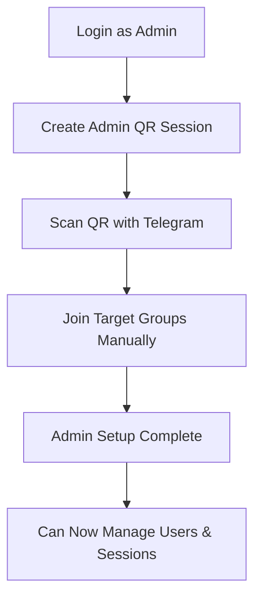

# Telegram Bot Manager

A comprehensive web-based Telegram automation system for managing multiple sessions, importing phone numbers, and adding users to groups/channels with advanced admin controls and rate limiting.

## 🚀 Features

- **🔐 Admin Authentication**: Secure admin login with username/password
- **📱 Multi-Session Management**: Create and manage multiple Telegram sessions (Admin + User sessions)
- **📋 Phone Number Import**: Import phone numbers from CSV, TXT, XLSX files
- **🎯 Automated User Addition**: Add imported phone numbers to target groups with intelligent rate limiting
- **📊 Real-time Monitoring**: Live progress tracking with detailed statistics
- **🛡️ Advanced Security**: Blacklist management, flood protection, session health monitoring
- **📄 Pagination**: 25 phone numbers per page, 10 sessions per page for easy management
- **⚙️ Flexible Configuration**: Customizable delays, batch sizes, daily limits

## 📋 Prerequisites

- Python 3.8 or higher
- Telegram API credentials (API_ID and API_HASH)
- Admin credentials for system access

## 🛠️ Installation & Setup

### Step 1: Install Dependencies
```bash
pip install -r requirements.txt
```

### Step 2: Get Telegram API Credentials
1. Visit https://my.telegram.org
2. Log in with your phone number
3. Go to "API Development Tools"
4. Create a new application
5. Note down your `API_ID` and `API_HASH`

### Step 3: Configure Environment
1. Copy `.env.example` to `.env`
2. Update the `.env` file with your credentials:
   ```env
   API_ID=your_api_id_here
   API_HASH=your_api_hash_here
   SECRET_KEY=your_secret_key_here
   ADMIN_USERNAME=your_admin_username
   ADMIN_PASSWORD=your_admin_password
   ```

### Step 4: Run the Application
```bash
python main.py
```

### Step 5: Access Web Interface
- Open http://localhost:5000 in your browser
- Login with your admin credentials

## 👨‍💼 Admin Setup & Workflow

### 🔑 Admin Authentication
1. **Login as Admin**: Use your configured admin username and password
2. **Admin Privileges**: Full access to all features, session management, and system settings

### 📱 Admin Session Setup (Required First Step)

**⚠️ IMPORTANT**: You must create an Admin session before using any automation features.

1. **Navigate to Admin Panel**
2. **Click "Create Admin QR Session"**
3. **Scan QR Code** with your Telegram account (this becomes your admin account)
4. **Join Target Groups**: As an admin, you must manually join all groups where you want to add users
5. **Verify Admin Session**: Ensure the admin session shows as "Active"



### 👥 User Session Management

#### Creating User Sessions
1. **Go to Sessions Page**
2. **Click "Add New Session"**
3. **Enter Session Name** (e.g., "User1", "Worker2")
4. **Choose Authentication Method**:
   - **QR Code**: User scans QR with their Telegram app
   - **Phone Number**: Enter phone number for SMS verification
5. **Complete Authentication**
6. **Session Auto-joins Target Group** (when automation starts)

#### Session Limits & Pagination
- **Display**: 10 sessions per page
- **Management**: Admin can remove any session
- **Health Monitoring**: Automatic session health checks
- **Daily Limits**: Configurable per-session daily addition limits

## 📞 Phone Number Management

### 📥 Importing Phone Numbers

#### Supported File Formats
- **CSV** (.csv)
- **Text** (.txt)
- **Excel** (.xlsx)

#### Required Format
- **Country Code**: Must start with `+251` (Ethiopian numbers)
- **No Spaces**: `+251912345678` ✅
- **No Dashes**: `+251-91-234-5678` ❌
- **No Parentheses**: `+251(91)2345678` ❌

#### Import Process
1. **Navigate to Phone Numbers Page**
2. **Click "Import Phone Numbers"**
3. **Select File** (CSV/TXT/XLSX)
4. **Review Import Results**
5. **Check Status**: Valid numbers are added to the system

#### Example File Formats

**CSV Format:**
```csv
phone_number
+251912345678
+251923456789
+251934567890
```

**TXT Format:**
```txt
+251912345678
+251923456789
+251934567890
```

**XLSX Format:**
| Phone Number |
|-------------|
| +251912345678 |
| +251923456789 |
| +251934567890 |

### 📊 Phone Number Status Tracking

#### Pagination & Display
- **25 phone numbers per page**
- **Status indicators**: Pending, Added, Failed, Blacklisted
- **Navigation**: Previous/Next page controls
- **Search & Filter**: Find specific numbers quickly

#### Status Types
- 🟡 **Pending**: Ready to be added
- 🟢 **Added**: Successfully added to group
- 🔴 **Failed**: Addition failed (temporary)
- ⚫ **Blacklisted**: Permanently blocked from addition

## 🎯 Automated User Addition

### 🔧 Configuration Settings

#### Basic Settings
- **Target Group**: Select destination group/channel
- **Delay Between Adds**: 30-120 seconds (recommended: 60s)
- **Batch Size**: 1-10 users per batch (recommended: 3-5)
- **Daily Limit**: Maximum users per session per day (recommended: 50-80)

#### Advanced Settings
- **Invite Message**: Custom welcome message (optional)
- **Use Admin as User**: Allow admin session to add users
- **Use User as Admin**: Allow user sessions to invite others

### 🚀 Starting Automation

#### Prerequisites Checklist
- ✅ Admin session created and active
- ✅ Admin joined target group manually
- ✅ At least one user session created
- ✅ Phone numbers imported
- ✅ Target group selected

#### Automation Process
1. **Navigate to Dashboard**
2. **Configure Settings**:
   - Select target group
   - Set delay (recommended: 60 seconds)
   - Set batch size (recommended: 5)
   - Set daily limit (recommended: 80)
3. **Click "Start Auto Add"**
4. **Monitor Progress**: Real-time updates on additions
5. **View Statistics**: Success/failure rates, remaining numbers


## 📈 Monitoring & Analytics

### 📊 Dashboard Features
- **Real-time Progress**: Live updates during automation
- **Session Status**: Active/inactive sessions overview
- **Daily Statistics**: Numbers added per day
- **Success Rates**: Addition success/failure percentages
- **Remaining Quota**: Daily limits per session

### 📋 Detailed Reporting
- **Phone Number Status**: Individual number tracking
- **Session Performance**: Per-session statistics
- **Group Information**: Target group member counts
- **Error Logs**: Detailed failure reasons

## ⚙️ Advanced Features

### 🛡️ Security & Protection
- **Flood Protection**: Automatic rate limiting
- **Session Health Checks**: Monitors session validity
- **Blacklist Management**: Prevents re-adding problematic numbers
- **Admin Authentication**: Secure access control

### 🔄 Session Management
- **Auto-reconnection**: Handles temporary disconnections
- **Session Cleanup**: Removes invalid sessions
- **Multi-session Support**: Distribute load across sessions
- **Session Rotation**: Prevents overuse of single sessions

### 📱 Group Management
- **Auto-join**: User sessions join target groups automatically
- **Group Validation**: Ensures admin has proper permissions
- **Member Count Updates**: Real-time group statistics
- **Multi-group Support**: Switch between different target groups

## 📁 Project Structure

```
TelegramBot - Main/
├── app/
│   ├── __init__.py              # FastAPI app factory
│   ├── session_manager.py       # Core Telegram session management
│   ├── database.py              # SQLite database operations
│   ├── admin_manager.py         # Admin authentication & settings
│   ├── auto_add.py              # Background automation supervisor
│   ├── templates/               # HTML templates
│   │   ├── index.html           # Dashboard
│   │   ├── sessions.html        # Session management
│   │   ├── phones.html          # Phone number management
│   │   └── login.html           # Admin login
│   └── static/                  # CSS, JS, images
│       ├── css/
│       ├── js/
│       └── images/
├── sessions/                    # Telegram session files (.session)
├── data/                        # SQLite database files
├── logs/                        # Application logs
├── main.py                      # FastAPI main entry point
├── requirements.txt             # Python dependencies
├── .env                         # Environment variables
└── README.md                    # This file
```

## 🔧 Configuration Options

### Environment Variables (.env)
```env
# Telegram API (Required)
API_ID=your_api_id
API_HASH=your_api_hash

# Security (Required)
SECRET_KEY=your_secret_key
ADMIN_USERNAME=admin
ADMIN_PASSWORD=your_password

# Optional Settings
PORT=5000
HOST=0.0.0.0
DEBUG=False
```

### Database Settings
- **Phone Numbers**: Stored in SQLite with status tracking
- **Sessions**: Metadata in database, files in `/sessions/`
- **Admin Settings**: Centralized configuration storage
- **Logs**: Detailed operation logs for debugging

## ⚠️ Important Notes & Best Practices

### 🛡️ Security Considerations
- **Session Files**: Keep `/sessions/` folder secure - contains authentication data
- **Admin Credentials**: Use strong passwords for admin access
- **API Credentials**: Never share your API_ID and API_HASH
- **Rate Limiting**: Built-in flood protection prevents Telegram bans

### 📱 Telegram Limitations
- **Daily Limits**: Telegram limits user additions per account
- **Group Permissions**: Admin must have "Add Users" permission
- **Phone Format**: Only Ethiopian numbers (+251) currently supported
- **Session Limits**: Recommended maximum 10 active sessions

### 🎯 Optimization Tips
- **Delay Settings**: 60+ seconds between additions recommended
- **Batch Sizes**: 3-5 users per batch for best results
- **Session Rotation**: Use multiple sessions to distribute load
- **Peak Hours**: Avoid automation during Telegram peak hours

## 🐛 Troubleshooting Guide

### Common Issues & Solutions

#### 🔴 "Admin session not found"
**Solution**: Create admin QR session first
```
1. Go to Admin Panel
2. Click "Create Admin QR Session"
3. Scan QR code with your Telegram
4. Verify session appears as active
```

#### 🔴 "No target group selected"
**Solution**: Select target group in settings
```
1. Ensure admin session exists
2. Join target group manually with admin account
3. Go to Dashboard → Select target group
4. Save settings
```

#### 🔴 "Flood wait error"
**Solution**: Increase delays
```
1. Stop current automation
2. Increase delay to 90+ seconds
3. Reduce batch size to 3
4. Restart automation
```

#### 🔴 "Session disconnected"
**Solution**: Recreate session
```
1. Delete problematic session
2. Create new session with different name
3. Complete authentication
4. Restart automation
```

#### 🔴 "Permission denied in group"
**Solution**: Check admin permissions
```
1. Verify admin account has "Add Users" permission
2. Check if group allows member additions
3. Ensure group is not restricted
4. Try with different admin account
```

#### 🔴 "Invalid phone number format"
**Solution**: Fix phone number format
```
Correct: +251912345678
Incorrect: 251912345678, +251 91 234 5678, 0912345678
```

### 📊 Performance Optimization

#### Recommended Settings by Group Size

| Group Size | Delay (seconds) | Batch Size | Daily Limit |
|------------|----------------|------------|-------------|
| < 1,000    | 45-60         | 5-7        | 100         |
| 1,000-5,000| 60-90         | 3-5        | 80          |
| 5,000-10,000| 90-120       | 2-3        | 60          |
| > 10,000   | 120+          | 1-2        | 40          |

### 🔍 Debugging Steps

1. **Check Logs**: Review `/logs/` for detailed error messages
2. **Verify Credentials**: Ensure API_ID/API_HASH are correct
3. **Test Sessions**: Create test session to verify connectivity
4. **Group Access**: Manually verify admin can access target group
5. **Phone Format**: Validate phone number format compliance

### 📞 Support & Maintenance

#### Regular Maintenance Tasks
- **Weekly**: Review session health and remove inactive sessions
- **Monthly**: Clean up old log files and optimize database
- **As Needed**: Update phone number lists and blacklist management

#### Monitoring Checklist
- ✅ Admin session active and connected
- ✅ User sessions healthy (< 10 total recommended)
- ✅ Daily limits not exceeded
- ✅ Success rate > 70%
- ✅ No flood wait errors in last 24 hours

---

## 📄 License & Disclaimer

**Important**: This tool is for educational and legitimate business purposes only. Users must:
- Comply with Telegram's Terms of Service
- Respect user privacy and consent
- Follow local laws and regulations
- Use responsibly and ethically

**Disclaimer**: The developers are not responsible for misuse of this software or any consequences arising from its use.